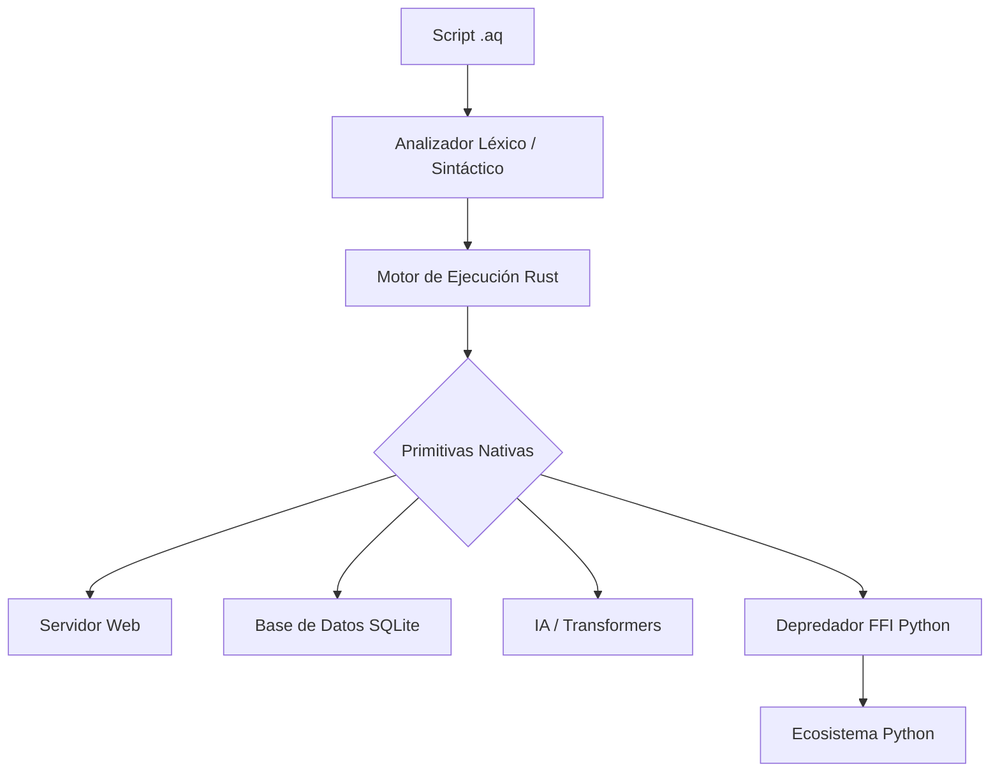

<p align="center">
  
</p>

# 🦅 Aquila: El Lenguaje Depredador de Python

<p align="center">
  
  
  
  
</p>

---

**Aquila** no es solo un lenguaje de programación; es una evolución biológica del software. Construido sobre el motor de **Rust**, Aquila nace con un único propósito: **devorar la ineficiencia de Python** y proporcionar una plataforma de desarrollo autónoma, rápida y en nuestro idioma.

> "La serpiente tiene un nuevo dueño." — Juan Manuel Peralta

## 🚀 ¿Por qué Aquila es el fin del reinado de Python?

| Característica | Python (Serpiente) 🐍 | Aquila (Águila) 🦅 |
| :--- | :--- | :--- |
| **Velocidad** | Interpretado (Lento) | Motor Rust (Ultra-rápido) |
| **IA** | Requiere 10+ librerías | Primitiva `ia()` nativa |
| **Web** | Flask/Django (Complejo) | `ServidorWeb` integrado |
| **Base de Datos** | Instalación externa | `BaseDatos` SQLite nativa |
| **Sintaxis** | Inglés | Español / Pseudocódigo Natural |
| **Binarios** | Difícil de empaquetar | Binarios portátiles nativos |

---

## 🧠 Características Core

### 1. El Guardián (IA Nativa)
Aquila no usa librerías para IA; **Aquila es IA**. Con la función `ia()`, el lenguaje se auto-conecta con Groq, Claude, Ollama o OpenAI según la configuración, permitiendo lógica inteligente en el corazón de tus scripts.

### 2. Depredador FFI (Caza a Python)
Mediante el comando `usar`, Aquila secuestra el ecosistema de Python. Puedes importar `numpy`, `pandas` o cualquier módulo `.py` y ejecutarlo con la potencia y seguridad de Rust.

### 3. El Arquitecto (CLI Generativo)
El comando `crear` utiliza LLMs locales para generar la arquitectura completa de un proyecto basándose solo en tu descripción.

---

## 🛠️ Instalación Rápida

### Linux & macOS
```bash
curl -fsSL https://aquila-lang.dev/install.sh | bash
```

### Windows
```bash
winget install aquila-lang
```

---

## 💻 Ejemplo de Poder

### Un Servidor API con IA en 5 líneas:
```aquila
// 🦅 Aquila v2.1
servidor = nuevo ServidorWeb(8080)

servidor.ruta("GET", "/pregunta", funcion(req) {
    respuesta = ia(req.parametros.pregunta)
    retornar {"respuesta": respuesta, "autor": "Juan Manuel Peralta"}
})

servidor.iniciar()
```

---

## 🏛️ Arquitectura del Sistema



---

## 👤 El Creador
**Juan Manuel Peralta Chacón**  
Estudiante de Ingeniería de Sistemas  
*Visión: Democratizar el alto rendimiento y la IA mediante un lenguaje que hable nuestro idioma.*

- 📧 **Correo:** [peraltachaconjuanmanuel5@gmail.com](mailto:peraltachaconjuanmanuel5@gmail.com)
- 💬 **WhatsApp:** [+57 321 4281888](https://wa.me/573214281888)
- 💳 **PayPal:** [paypal.me/JuanPeraltaChacon](https://www.paypal.me/JuanPeraltaChacon)

---

## ⚖️ Licencia
Este proyecto es **Open Source** bajo la licencia **GNU GPL v3**. La propiedad intelectual pertenece a **Juan Manuel Peralta Chacón (2026)**. Se fomenta la colaboración y el estudio, siempre respetando la autoría original.

---
<p align="center">🦅 <i>"El águila no caza moscas, caza serpientes."</i></p>
